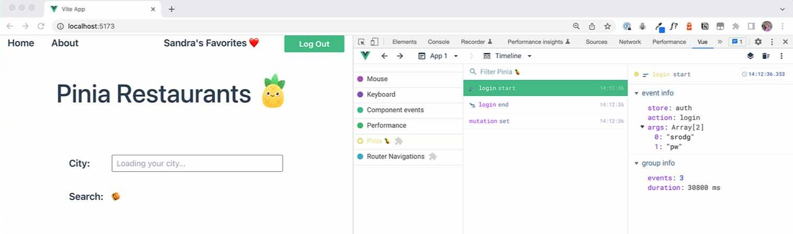

## Cuándo usar Pinia

>Antes de profundizar en las características y patrones de Pinia, aclaremos por qué querría usar Pinia en primer lugar. Especialmente teniendo en cuenta que la Composition API de Vue 3 ya tiene un potente sistema de reactividad incorporado con flexibilidad para compartir el estado.

## ¿Qué quiere decir con esto?

Bueno, con la Composition API por sí sola, podemos crear un objeto reactivo para que sirva como una tienda para administrar el estado global y luego importarlo en múltiples componentes:

📄 store.js
```js
import { reactive } from 'vue'

export const store = reactive({
  count: 0
})
```

Tenga en cuenta que estamos usando un archivo JS, que es común para las tiendas (así como para los composables).

La forma en que funciona el sistema de reactividad de Vue 3 significa que cualquier componente que importe esta tienda puede mutar directamente ese estado global, y cada componente que dependa de este estado actualizará su vista automáticamente.

Entonces, ¿cuándo es necesaria una biblioteca de gestión estado como Pinia?

En proyectos más pequeños, es posible que pueda salirse con la suya simplemente usando la Composition API de esta manera.

Pero aquí hay algunas razones por las que su proyecto podría beneficiarse del uso de Pinia:

A medida que crece una aplicación, las cosas pueden complicarse. Querremos implementar patrones para la organización. Esto es especialmente importante cuando varias personas trabajan en una aplicación grande. Pinia ayuda a administrar y realizar un seguimiento de cómo se actualizan los datos en una aplicación.

Si no se siente cómodo con la mutación del estado global en cualquier componente, es posible que desee seguir la práctica de escribir funciones claramente nombradas que puedan mutar el estado. Si está utilizando Pinia, esas funciones se llaman acciones. Una ventaja adicional es que las herramientas de desarrollo de Vue rastrean cada acción de Pinia, lo que nos facilita identificar exactamente qué está causando el cambio de estado en nuestra aplicación.



>Si su aplicación utiliza la [representación del lado del servidor](https://vuejs.org/guide/scaling-up/ssr.html), deberá tener más cuidado con la forma en que administra el estado global. Las aplicaciones SSR inicializan los módulos de la aplicación en el servidor y luego comparten el estado en cada solicitud. Esto podría conducir a vulnerabilidades de seguridad. Pinia se diseñó para que sea más fácil y seguro administrar el estado en las aplicaciones SSR.

Además, Pinia tiene la ventaja de ser muy fácil de usar, especialmente cuando se compara con la biblioteca de administración de estado anterior de Vue, [Vuex](https://vuex.vuejs.org/). Tiene una excelente compatibilidad con [TypeScript](https://www.typescriptlang.org/) y una experiencia de desarrollador de primera clase; como se mencionó, la integración de herramientas de desarrollo de Pinia hace que sea muy fácil ver dónde y cómo se producen los cambios de estado, lo que le brinda una excelente herramienta para la depuración.

Como ingenieros, nuestro trabajo es hacer que las cosas funcionen de manera eficiente, escribiendo menos código que haga precisamente lo que necesitamos que haga. El uso de un sistema de administración de estado global como Pinia nos ayuda a lograr esto al permitirnos planificar nuestras aplicaciones en un nivel superior. Esto es especialmente importante para aplicaciones a gran escala con varios miembros del equipo.

>Ahora que entendemos por qué Pinia puede ser una gran adición a nuestra aplicación, comenzaremos a aprender sobre un tema muy importante: Options Stores y Setup Stores. Esta es una información realmente crucial, así que te recomiendo que no te la saltes. ¡Nos vemos en la próxima lección! 
