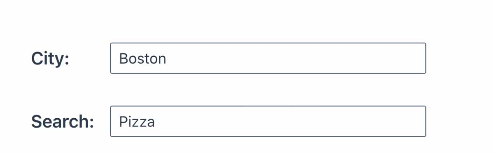
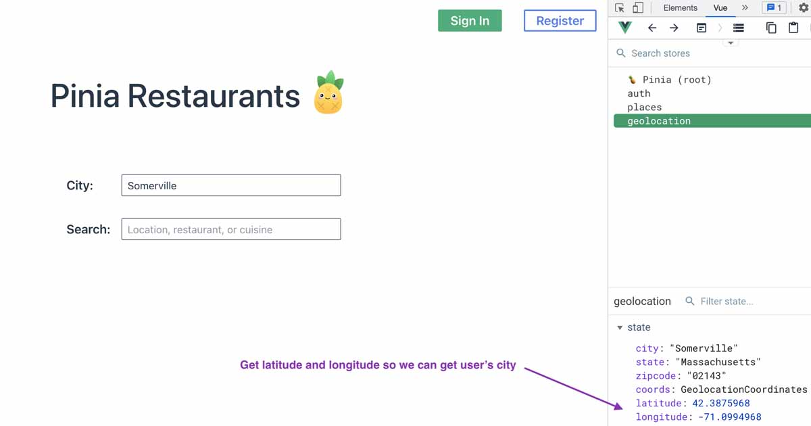
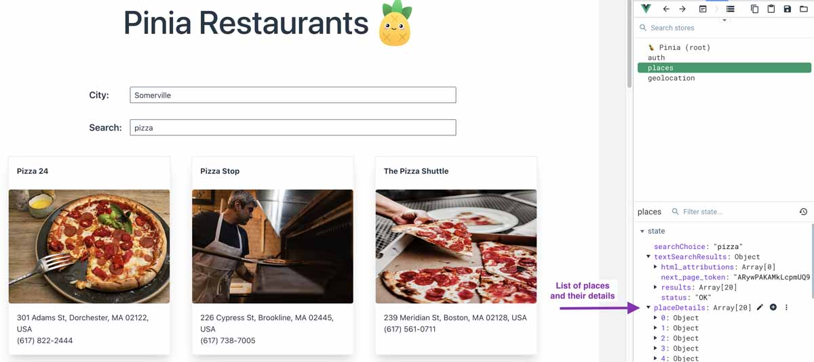
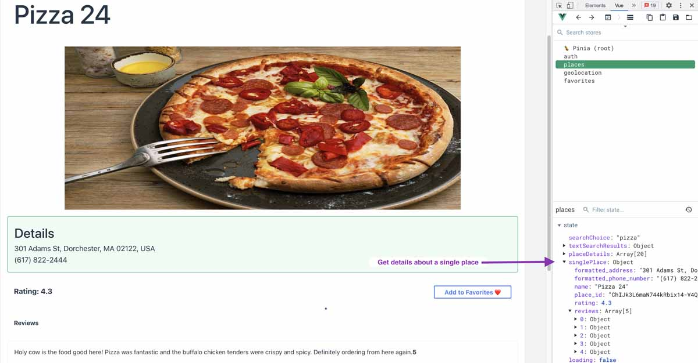

# Tiendas Modulares

>Una de las características más importantes de Pinia son sus tiendas modulares. Al usar Pinia, creamos una tienda enfocada en cada preocupación lógica de nuestra aplicación.

De hecho, podemos definir tantas tiendas como queramos. Cada uno de ellos debe estar en su propio archivo, lo que ayudará a mantener nuestro código organizado y también conectará cada tienda por separado a las **devtools** para que podamos rastrear fácilmente el estado de cada tienda.

A veces es más obvio cuándo se debe crear una tienda. Otras veces es difícil saber cuándo dividir las tiendas más grandes en tiendas distintas. Primero, veamos un ejemplo más sencillo.

## Ejemplo de Tienda de Autenticación

En nuestro proyecto de ejemplo, un usuario puede registrar una cuenta, iniciar sesión y cerrar sesión. Todas estas acciones están relacionadas con el estado del usuario.

A lo largo de la aplicación, la interfaz de usuario cambiará dependiendo de si un usuario ha iniciado sesión. Por ejemplo, si ha iniciado sesión, mostraremos su nombre y un enlace a sus favoritos en la barra de navegación.


El estado del usuario es de lo que debemos hacer un seguimiento, y las acciones relacionadas con eso (registro, inicio de sesión, cierre de sesión) se pueden mantener en el mismo archivo de la tienda. Podríamos llamar a esto la tienda `auth` o la tienda `user`.

`📄 src/stores/auth.js`
```js
export const useAuthStore = defineStore("auth", {
  state: () => ({
     user: ref({}),
  }),

// actions, etc

});
```

Crear una tienda en torno a la misma preocupación lógica de autenticación es un caso de uso común para una tienda Pinia, y es bastante sencillo. Pero no siempre está tan claro cómo deberíamos dividir lógicamente nuestras otras tiendas.

Ahora, veamos un ejemplo menos sencillo.

## Organización de tiendas más compleja

En la aplicación **Pinia Restaurants**, hay una barra de búsqueda con dos entradas.

El primer `input` toma la ubicación de una ciudad.

El segundo `input` toma un término de búsqueda para encontrar restaurantes relacionados, por ejemplo, _pizza_, _sushi_, _helados_, _etc_.



Ambos `inputs` tienen detectores de eventos que activan una función cuando el usuario escribe texto. Cada función realiza una llamada a la **API de Google Maps**.

- **City**: pide la latitud y longitud de la ubicación ingresada por el usuario
- **Search**: utiliza la ubicación ingresada para devolver solo los restaurantes dentro de cierta proximidad
    
En otras palabras: tanto la ciudad como las entradas de búsqueda utilizan **datos de ubicación** y ambos utilizan la **API de Google Maps**.

Entonces, ¿deberían combinarse dentro de la misma tienda? ¿Una tienda de **googleMaps**, tal vez?

Bueno, hay bastantes acciones en este proyecto que dependen de la **API de Google Maps**. Eso es mucho código en una sola tienda...

Y lo que es más importante, las acciones no están todas relacionadas con las mismas preocupaciones lógicas.

Podríamos desglosarlo para centrarnos más en para qué se utiliza la **API de Google Maps**.


::: info Pregúntese:
¿Por qué no intentamos centrarnos en los estados de la data? ¿Qué datos necesitamos rastrear? ¿Para qué se utilizan los datos? ¿Con qué se relacionan los datos del estado? ¿Se puede agrupar en torno a una preocupación lógica?
:::

Algunos de los datos del estado que necesitamos están relacionados con la ubicación: obtener la latitud y la longitud del valor del `input` de la ciudad. Se trata de datos utilizados para realizar solicitudes de `geolocation`.



Otros datos del estado que necesitamos están relacionados con los restaurantes: la lista de restaurantes que coinciden con el término de búsqueda (y sus detalles: _name_, _address_, _rating_, _reviews_, _etc_.) dentro de una cierta distancia de la ciudad.

En otras palabras, este estado es la información que queremos presentar al usuario sobre los restaurantes.





Basado en este razonamiento, parece que podemos hacer dos tiendas con sus propias preocupaciones lógicas compartidas:

- `Geolocation.js`
- `Restaurants.js`

**Pero que pasa…**

>En la tienda de `restaurants`, hay una solicitud para obtener una lista de restaurantes relevantes, y requiere el uso de datos de `geolocation` para obtener restaurantes dentro de un área geográfica determinada. Necesitamos usar datos de la tienda de `geolocation` en la tienda de `restaurants`.

¿Esto arruina por completo nuestro enfoque para crear tiendas separadas? ¡De nada!

## Tiendas anidadas

>Podemos compartir el estado entre dos tiendas si es necesario. A esto lo llamamos tiendas anidadas.

Un detalle importante para recordar acerca de las tiendas anidadas es que la forma en que usamos las tiendas anidadas (compartir `data`, `actions` y `getters` entre tiendas) dependerá del tipo de tienda que elijamos usar: una tienda de **Options** o una tienda de **Setup**.

## Tiendas de Setup Anidadas

>En una tienda de **Setup**, podemos importar y llamar a la función `useGeoLocationStore()` en la parte superior de la función de tienda.

`📄 src/stores/restaurants.js`
```js{7}
import { ref } from "vue";
import { defineStore } from "pinia";
import myFetch from "../helpers/myFetch";
import { useGeoLocationStore } from "./geolocation";

export const useRestaurantsStore = defineStore("restaurants", () => {
  const locationStore = useGeoLocationStore(); // This has to be inside the setup function
  const searchChoice = ref("");
  const restaurantDetails = ref([]);
  const singleRestaurant = ref({});
  const textSearchResults = ref([]);
  const loading = ref(false);

  // get list of relevant restaurants
  async function getRestaurants() {
    loading.value = true;
    restaurantDetails.value = []; // reset to empty

    const lat = locationStore.latitude || locationStore.coords.value.latitude;
    const long = locationStore.longitude || locationStore.coords.value.longitude;
    const search = searchChoice.value;
    const body = { lat, long, search }; // uses data from locationStore to make this request
    myFetch("find-restaurant", "POST", body)
      .then((res) => {
        loading.value = false;
        textSearchResults.value = res.response.value;
        return res;
      })
      .then((result) => {
        for (let i = 0; i < result.response.value.results.length; i++) {
          const restaurant = result.response.value.results[i];
          getRestaurantDetails(restaurant.place_id);
        }
      });
  }

  // get rating, reviews, other info about each place (using Google Maps place_id)
  async function getRestaurantDetails(place_id) {
    const body = { place_id };
    myFetch("restaurant-details", "POST", body).then((res) => {
      restaurantDetails.value.push(res.response.value.result);
    });
  }

  // get single place for individual restaurant page
  function getSingleRestaurantDetails(place_id) {
    if (restaurantDetails.value.length) {
      const foundPlace = restaurantDetails.value.find((x) => {
        return x.place_id === place_id;
      });
      if (foundPlace) {
        singleRestaurant.value = foundPlace;
      } else {
        const body = { place_id };
        myFetch("restaurant-details", "POST", body).then((res) => {
          singleRestaurant.value = res.response.value.result;
        });
      }
    } else {
      const body = { place_id };
      myFetch("restaurant-details", "POST", body).then((res) => {
        singleRestaurant.value = res.response.value.result;
      });
    }
  }

  function resetRestaurantsStore() {
    searchChoice.value = "";
    restaurantDetails.value = [];
    singleRestaurant.value = {};
    textSearchResults.value = [];
    loading.value = false;
  }

  return {
    searchChoice,
    getRestaurants,
    textSearchResults,
    restaurantDetails,
    getSingleRestaurantDetails,
    singleRestaurant,
    getRestaurantDetails,
    loading,
    resetRestaurantsStore,
  };
});
```

## Tiendas de Options Anidadas

>Alternativamente, en una tienda de **Options**, necesitaremos importar y llamar a la función `useStore()` dentro de la `action` o `getter` donde necesitamos acceder a la tienda.

Para ver eso en uso, podemos echar un vistazo dentro de la tienda de `favorites` del código de nuestra aplicación de ejemplo:

`📄 src/stores/favorites.js`
```js{12}
import { defineStore } from "pinia";
import { useAuthStore } from "./auth";
import myFetch from "../helpers/myFetch";

export const useFavoritesStore = defineStore("favorites", {
  state: () => ({
    userFavorites: [],
  }),
  actions: {
    async getFavorites() {
      // options store must use this within the action where it is needed
      const authStore = useAuthStore(); // This has to be inside the action or getter respetively

      // logic to get favorites
      myFetch("favorites").then((res) => {
        const userFav = res.response.value.favorites.filter((x) => {
          return x.user === authStore.user.username; // user from authStore
        });

        this.userFavorites = userFav;
      });
      });
    },
```

Como puede ver, la tienda de **Setup** gana nuevamente por ser un poco más conveniente. Una vez que haya importado esa tienda y haya llamado a la función `useStore()`, puede usarla en cualquiera de sus `actions` y `getters` dentro de esa función de tienda.

## Envolviendo las cosas

>Terminemos pensando en los puntos importantes de esta lección:

- Las tiendas modulares mantendrán nuestro proyecto más organizado.
- Cree tiendas en torno a preocupaciones lógicas. Mire los datos de estado que está rastreando. Las propiedades de estado relacionadas significan que podríamos crear una tienda separada para rastrear esas propiedades. También podemos pensar en una característica específica de la aplicación; tal vez crearíamos una tienda en torno a esa característica si tiene sentido
- No asuma que debe crear automáticamente una tienda en torno a una API o una biblioteca que está utilizando. Esas herramientas pueden usarse para preocupaciones lógicas separadas en su aplicación.
- Podemos compartir `data`, `actions` y `getters` entre tiendas con tiendas anidadas.    

## En la siguiente lección

>Veremos cómo podemos usar Pinia para administrar el estado global: cómo accedemos a él, cómo lo mutamos y cómo lo usamos con las funciones de reactividad de Vue.
