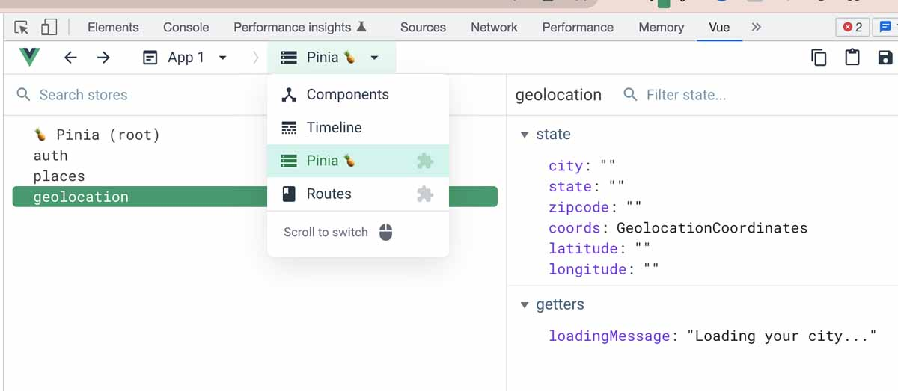
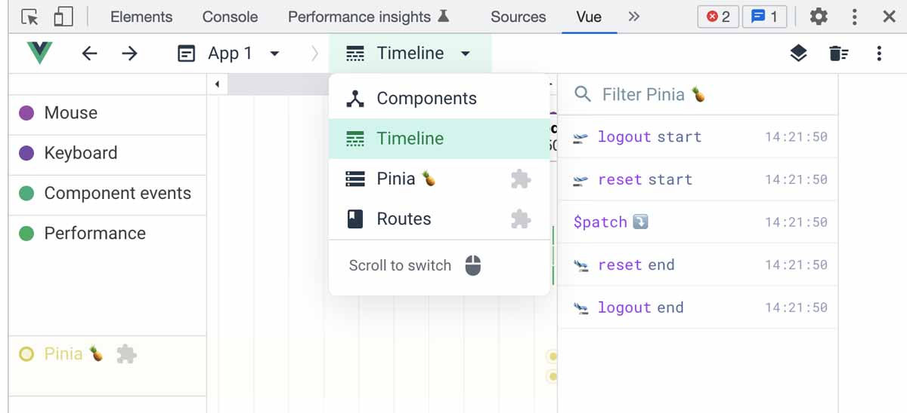
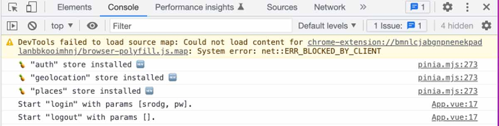

# Mutando el Estado

En la última lección, vimos cómo podemos acceder al estado desde Pinia y también cómo podemos usar `v-model` para vincular propiedades de estado en una tienda de Pinia. Ahora hablemos de mutación de estado.

## Mutando el Estado

Aquí es donde Pinia se vuelve un poco... controvertida. Pinia nos permite mutar el estado de varias maneras, permitiéndonos decidir dónde y cuándo queremos actualizar el estado en nuestra aplicación. Otras bibliotecas de administración de estado son mucho más estrictas sobre cómo se cambia el estado.

>Por ejemplo, la antigua biblioteca oficial de gestión de estado de Vue, [Vuex](https://vuex.vuejs.org/), requería que los cambios de estado se iniciaran mediante el envío de una acción para cometer una mutación; esa era la única forma de cambiar de estado (a menos que estuviera rompiendo ese patrón en contra de las mejores prácticas recomendadas).

Pinia se ha deshecho de las mutaciones independientes por completo, brindándonos más opciones sobre cómo elegimos mutar el estado.

## Mutar el Estado de Pinia con Acciones

>La forma más común de mutar el estado usando Pinia es desencadenar una acción en la tienda que haga que se cambie el estado.

En este ejemplo, hacer clic en el botón **Add to Favorites** activará la acción agregar a favoritos en la tienda de `favorites`.

`📄 src/views/RestaurantView.vue`
```html
<button @click="favoritesStore.addToFavorites(singleRestaurant.name)">
 Add to Favorites ❤️
</button>
```

La acción `addToFavorites` publica el favorito en la lista de favoritos del usuario.

`📄 src/stores/favorites.js`
```js
import { defineStore } from "pinia";
import { useAuthStore } from "./auth";
import myFetch from "../helpers/myFetch";

export const useFavoritesStore = defineStore("favorites", {
  state: () => ({
    userFavorites: [],
  }),
  actions: {
    // This action mutates state by adding a favorite to userFavorites (that happens on the backend so the database is updated)
    async addToFavorites(restaurant_name) {
      const authStore = useAuthStore();
      const username = authStore.user.username;
      const body = {
        user: username,
        restaurant_name,
      };
      
      // The user's favorite will be added to the database
      myFetch("favorites", "POST", body).then((res) => {
        return res;
      });
    }
  },
});
```

Cuando la solicitud de publicación llega al punto final en el archivo del servidor, ejecuta más lógica para publicar el favorito en la base de datos (o en este caso, el archivo JSON que creamos para representar una base de datos).

`📄 /server.js`
```js
app.post("/favorites", (req, res) => {
  const favorites = JSON.parse(fs.readFileSync("./db/favorites.json"));
  if (req.body) {
    favorites.push(req.body);
    fs.writeFileSync("./db/favorites.json", JSON.stringify(favorites, null, 4));
    res.send(req.body);
  } else {
    res.sendStatus(400);
  }
});
```

>Este fue un ejemplo de una forma muy común de mutar el estado mediante el uso de una acción.

Algunas personas se sorprenden cuando descubren que esta no es la única forma de cambiar el estado de Pinia. De hecho, he oído hablar de personas que afirman que usar acciones es la única forma en que podemos mutar el estado en Pinia. ¡Pero ese no es el caso!

## Mutando el Estado Directamente

>También podemos cambiar de estado directamente asignando un nuevo valor a la propiedad `state`.

En el componente `Search.vue` de nuestra aplicación **Pinia Restaurants**, hay un `watcher` en el valor de `city` para que, si el usuario elimina la ciudad, borre los datos de búsqueda para que pueda iniciar una nueva búsqueda.

`📄 src/components/Search.vue`
```js
const { searchChoice, restaurantDetails} = storeToRefs(restaurantsStore);

watch(city, (newVal) => {
  if (newVal) {
    restaurantDetails.value = [];
    searchChoice.value = "";
  }
});
```

Se accede a las propiedades `restaurantDetails` y `searchChoice` desde la tienda **restaurants** y, como vemos aquí, estas dos propiedades se establecen directamente en un arreglo vacío y una cadena vacía cuando cambia el valor de `city`. No estamos obligados a mutar estas propiedades de estado a través de una acción de Pinia. Podemos mutar directamente el estado aquí mismo en el componente.

## Actualización de estado con `$patch`

>Otra forma en que podemos establecer el estado es usar el método `$patch` de Pinia. Este método nos permite aplicar múltiples cambios a la vez al estado de la tienda.

Aquí está la misma lógica, pero esta vez usando `$patch`:

`📄 src/components/Search.vue`
```js
watch(city, (newVal) => {
  if (newVal) {
    restaurantStore.$patch({
      restaurantDetails: [],
      searchChoice: "",
    });
  }
});
```

>Aquí, enviamos un objeto con los cambios que queremos a `restaurantDetails` y `searchChoice`.

Si no le gusta la idea de mutar el estado directamente en un componente sin una acción, puede limitarse a usar solo `actions` y `$patch` para realizar cambios en los datos de la tienda.

Es fácil buscar `$patch` dentro de su código o `actions` por su nombre.

Pero no olvide que siempre tenemos **devtools** para ayudarnos a rastrear los cambios en el estado, por lo que es posible que no necesitemos ser tan estrictos al agregar un patrón autoimpuesto como ese para la mutación del estado.

Ah, y `$patch` es especialmente útil porque puede tomar un objeto o una función como su parámetro.

A veces, es posible que necesitemos una lógica más complicada para actualizar el estado, como usar métodos de matriz para actualizar una propiedad de estado que es una matriz. Enviar una función a través del método `$patch` nos brinda más capacidad para hacer una lógica compleja para mutar el estado.

Ejemplo:

```js
restaurantsStore.$patch((state) => {
  state.restaurantDetails.splice(0, state.restaurantDetails.length)
  state.searchChoice = ""
})
```

## Restablecer estado con `$reset`

>Convenientemente, Pinia también ofrece un método `$reset` para que podamos restablecer el estado completo de una tienda a su valor inicial.

En este ejemplo, el método `$reset` se usa dentro de la propia tienda. Dado que este ejemplo es una **Options Store**, podemos acceder al método `$reset` usando `this` para borrar el estado del usuario de la tienda de autenticación. Esto restablece al usuario a un objeto vacío.

`📄 src/stores/auth.js`
```js
actions: {
  logout() {
    this.$reset();
    router.push("/");
  },
  // ...
}
```

También podríamos usar `$reset` en un componente:

```html
<button v-if="user && user.username" @click="authStore.$reset()">
  Log Out
</button>
```
>Usar una función de reinicio como esta es realmente útil si necesitamos actualizar una tienda completa a la vez, como cuando el usuario navega a una página determinada.

Eche un vistazo a este ejemplo en el que usamos el método de reinicio de Pinia en el enrutador.

`📄 src/router/index.js`
```js
router.beforeEach((to) => {
  const restaurantsStore = useRestaurantsStore();
  if (to.name === "home") restaurantsStore.$reset();
});
```

Sí, podemos acceder al estado de Pinia en un archivo de enrutador. Aquí, si quisiéramos restablecer toda la información de **restaurant**, borrando una búsqueda anterior cuando un usuario navega de regreso a la página de inicio, podemos llamar a la función `$reset` cada vez que alguien navega de regreso a la página de inicio.

## Una limitación de los Setup Stores

>Desafortunadamente, el método `$reset` no está disponible si usamos un **setup store**.

¡Aquí hay un ejemplo en el que las ***options store** tienen una ventaja sobre las **setup store**!

Esto se debe a que el método `$reset` se basa en la función `state()` para crear un nuevo estado, reemplazando el `store.$state` actual por uno nuevo. Como no tenemos esa función `state()` en una **setup store**, Pinia no tiene forma de hacer esto.

```js
// We have a state function in options stores
state: () => ({
    userFavorites: [],
})
```
>Sin embargo, esta podría ser una buena oportunidad para crear un complemento de Pinia (hablaremos más sobre eso en la [próxima lección](./pinia-plugins.html)).

Otra posibilidad sería simplemente crear nuestro propio método de reinicio para una tienda individual.

For example, we could create an Action that serves the purpose of resetting our entire store. Here’s how that could look, with a resetRestaurantsStore action to clear out each state property in the restaurants store, resetting the store to its original state. We would only need to use this if our store is a setup store and we’re needing a function to reset the entire state.

Por ejemplo, podríamos crear una Acción que sirva para restablecer toda nuestra tienda. Así es como podría verse, con una acción `resetRestaurantsStore` para borrar cada propiedad de estado en la tienda **restaurant**, restableciendo la tienda a su estado original. Solo necesitaríamos usar esto si nuestra tienda es una **setup store** y necesitamos una función para restablecer todo el estado.

`📄 src/stores/restaurants.js`
```js
//action in a setup store

function resetRestaurantsStore() {
    searchChoice.value = "";
    restaurantDetails.value = [];
    singleRestaurant.value = {};
    textSearchResults.value = [];
    loading.value = false;
}
```

## Claridad a través de Devtools

>Estas son solo algunas de las formas en que podemos acceder y mutar el estado con Pinia. Si bien puede parecer mucho, tenga en cuenta que el soporte de **devtools** es excelente.

Podemos ver cada propiedad de estado y actualización de getter en el panel de herramientas de desarrollo de Pinia, y vemos a qué tienda pertenecen.




Y podemos ver cada acción y parche que ocurre si revisamos el panel de la línea de tiempo.



## $onAction

>Mientras terminamos esta lección, centrémonos en una última herramienta. Pinia también ofrece un método útil que podemos usar para obtener información muy detallada sobre las acciones: el método `$onAction`.

Como puede ver, este método tiene una serie de **hooks** que podemos usar para realizar alguna lógica cuando ocurre una determinada acción.

```js
store.$onAction(({ name, store, args, after, onError }, state) => {
  // ...
})
```

Tenga en cuenta cómo podemos pasar el estado como un segundo argumento, en caso de que lo necesitemos.

Aquí se utiliza para registrar información sobre qué acción se ha activado en el **auth store**.


`📄 src/App.vue`
```js
authStore.$onAction(({ name, store, args }) => {
  console.log(`Start "${name}" with params [${args.join(", ")}].`);
});
```

En la consola, cuando el usuario inicia sesión con el nombre de usuario 'srodg' y la contraseña 'pw', vemos que está registrado. Y vemos que cerrar sesión no requiere parámetros.



Pero probablemente rara vez necesitemos usar la consola para registrar esta información, ya que la tenemos toda en las **devtools**.

## A continuación ...

Estamos casi al final del tutorial, pero tenemos una cosa más de la que hablar: los complementos de Pinia. En la próxima lección, aprenderemos cómo agregar nuestros propios complementos creados por el usuario a Pinia para ayudarnos a hacer aún más.
