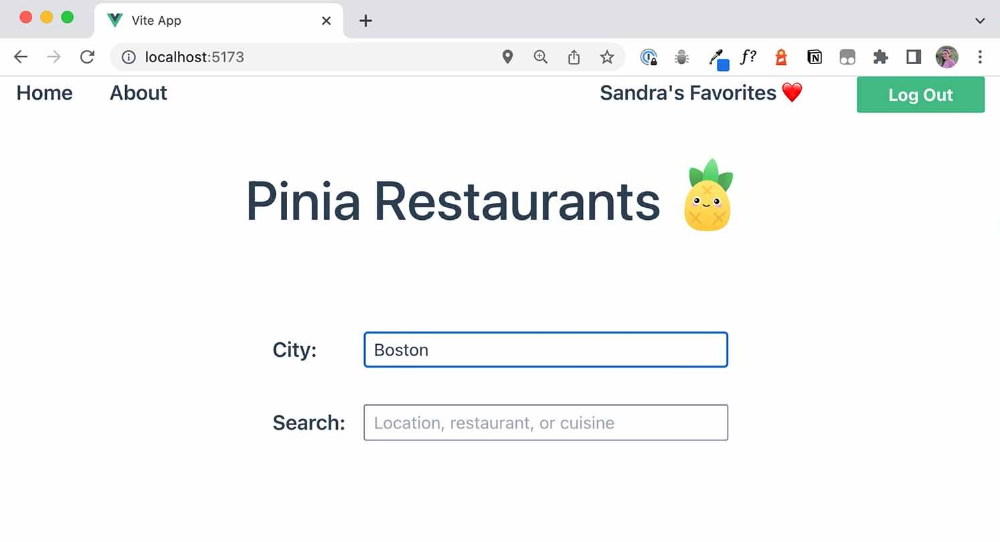

# Options vs Setup Stores

>Con Pinia, hay dos formas diferentes de definir un _store_. Estos dos tipos de _store_ se conocen como [Options Store](https://pinia.vuejs.org/core-concepts/#option-stores) y [Setup Store](https://pinia.vuejs.org/core-concepts/#setup-stores). Puedes elegir qué tipo de _store_ quieres usar. Ambos hacen básicamente lo mismo; la elección que haga dependerá de su propia preferencia personal o de su experiencia anterior con el uso de las diferentes API de Vue.

Primero, repasemos cómo definimos un _store_ con Pinia.

## Definición de un _Store_ Pinia

Cada vez que queramos crear un _store_, ya sea un _options store_ o un _setup store_, debemos importar `defineStore` desde Pinia. Luego pasamos un _string_ para el nombre del _store_ como primer parámetro.

```js
import { defineStore } from 'pinia'

export const useAuthStore = defineStore('auth', ... )
```

>Este _string_ es como una identificación: debe ser único porque así es como Pinia rastrea el estado de cada _store_ individual. Es el nombre del _store_ que verá en **devtools** para ese _store_ en particular.

Cuando creamos una identificación (o nombre) de _store_, eso crea una propiedad en el objeto de estado de la instancia de Pinia, y ahí es donde **devtools** busca los nombres de los _stores_ para mostrarnos.

## Options Stores

Si ha visto algunos otros cursos sobre Pinia, ya habrá aprendido a crear una Options Stores.

```js
//Options Store

import { defineStore } from 'pinia'

export const useTodoStore = defineStore('ToDoStore', {
  state: () => ({
    todos: []
  }),
  actions: {
    addTodo(todo){
      this.todos.push(todo)
    }
  },
  getters: {
    doneTodos: (state) => state.todos.filter(todo => todo.done) 
  }
})
```

Lo que hace que esto sea un Options Stores es el segundo parámetro que pasamos a la función `defineStore`: es un objeto de opciones.

Esta sintaxis se sentirá similar a la Options API de Vue si la ha usado antes, especialmente los datos, métodos y propiedades calculadas de la Options API.

>En un tienda de opciones, el estado corresponde a los datos, las acciones a los métodos y los captadores a los computados.

## Setup Stores

>Entonces, las Options Stores se sienten similares a la forma de hacer las cosas de la Options API... pero ¿eso significa que las Setup Stores se sienten similares a la forma de hacer las cosas de Vue 3 Composition?

¡Sí! Si ha estado usando la Composition API de Vue 3, una Setup Stores le resultará mucho más familiar.

En una Setup Stores, el segundo parámetro que pasamos a `defineStore` es una función:

```js
// Setup Store

import { defineStore } from 'pinia'
import { ref, computed } from 'vue'

export const useTodoStore = defineStore('ToDoStore', () => {

  const todos = ref([])
  
  function addTodo(todo){
    todos.value.push(todo)
  }
  
  const doneTodos = computed(
    () => todos.value.filter(todo => todo.value.done)
  )
  
  return { todos, addTodo, doneTodos }
})
```

Al igual que la función **setup** en la Composition API, podemos crear un estado reactivo usando `refs` o `reactivo`. Nuestras acciones que pueden cambiar de estado se escribirán como funciones. Y podemos crear `getters` usando el ayudante `computed` de Vue.

>Cualquier propiedad de estado, función o propiedad calculada debe devolverse en un objeto.

Esto es similar a la forma en que funciona la función **setup** en la Composition API, si está utilizando la sintaxis tradicional.

Muchas personas optan por utilizar una sintaxis abreviada denominada **Script Setup API** en sus archivos de componentes de Vue 3, y verá que se utiliza en el proyecto de ejemplo de este tutorial (el proyecto Pinia Restaurants).

Sin embargo, las **stores** de Pinia son archivos de JavaScript similares a los composables de Vue 3 y no pueden usar la sintaxis simplificada de **script setup**. Solo los archivos Vue pueden.

>Tenemos que usar la sintaxis **setup** tradicional, por lo que devolvemos propiedades y acciones de estado en el objeto devuelto si queremos que estén disponibles para otros archivos de Vue y las **devtools**.

## ¿Cuál usar: Options o Setup store?

>En última instancia, la elección de utilizar una Options Store o una Setup Store depende de las preferencias y demandas de usted o de su equipo. Sin embargo, hay varias ventajas de usar una Setup Store.

Las Setup Store nos permiten aprovechar la API de reactividad de Vue 3. Podemos usar composables, como funciones de composición de terceros de la biblioteca [VueUse](https://vueuse.org/), y podemos usar [watchers](https://vuejs.org/guide/essentials/watchers.html).

Veamos una característica de nuestra aplicación de ejemplo, Restaurantes Pinia, donde podemos usar un `watcher`.

Cuando el usuario carga la página, hay una entrada para escribir su ciudad.

Pero si el usuario no escribe nada, su ubicación actual se encontrará automáticamente. Así que puedan usar la ubicación que se carga para ellos, o pueden ingresar una nueva ubicación.



La función que carga su ubicación automáticamente se basa en el componente [`useGeolocation` de VueUse](https://vueuse.org/core/useGeolocation/).

Podemos traer ese composable al `store` de geolocalización importándolo desde la biblioteca VueUse. Y luego debemos usar el composable dentro de la función `setup` para que Vue pueda hacer su magia para realizar un seguimiento de los efectos de reactividad relacionados con este composable.

`📄 src/stores/geolocation.js`

```js
import { watch } from 'vue'
import { defineStore } from 'pinia'
import { useGeolocation } from '@vueuse/core'

export const useGeoLocationStore = defineStore('geolocation', () => {
  const { coords } = useGeolocation()
  
  // watch for coordinates to load or update, get a new location
  watch(() => coords.value, (newValue) => {
      if(newValue){
        getLocation(coords.value.latitude, coords.value.longitude)
      }
    }
  )

  async function getLocation(latitude, longitude){
    // fetch location data from Google Maps API
  }

  return { getLocation, coords }
})
```

La acción `getLocation` buscará una ubicación mediante la API de **Google Maps**. Nos dará la ciudad si le enviamos coordenadas. Necesitaremos la latitud y la longitud del usuario para hacer esto, lo cual puede hacer por nosotros el composable `useGeolocation` de VueUse.

Sin embargo, dado que el composable `useGeolocation` debe solicitar permiso para obtener la ubicación del usuario y hay un poco de retraso para que se carguen las coordenadas de la ubicación, significa que no podemos activar la acción instantáneamente cuando el componente se monta por primera vez. Necesitamos activarlo después de que se hayan cargado las coordenadas.

Aquí es donde entra en juego el `watcher`. Podemos observar el valor de las coordenadas y, cuando ese valor llegue, desencadenar la acción `getLocation`.

## No es un factor decisivo

Si bien poder usar **watchers** es definitivamente una ventaja de los **stores** de **setup**, no es un factor decisivo para los **stores** de **Options**. Hay formas de evitar tener que escribir este **watcher** en el **store**.

Por ejemplo, podríamos usar el componente `useGeolocation` en un componente y ver los valores allí, luego desencadenar la acción en el **store** desde el componente.

Sin embargo, si se siente cómodo con la **Composition API** y un **watcher** es una buena opción para su solución, entonces los **stores** de **setup** son el camino a seguir. Pero si no usa la **Composition API** o si es relativamente nuevo en Pinia, es mejor que se quede con el **store** de **Options**. Elija el tipo de **store** que le parezca adecuado para usted y sus casos de uso.

## A continuación: Tiendas Modulares

En la próxima lección, aprenderemos cómo Pinia ayuda a mantener las aplicaciones más organizadas con sus **stores** modulares. Es el primer paso para usar Pinia, diseñando una aplicación que sea más fácil de entender para los miembros del equipo debido a su organización en torno a áreas de interés separadas.
