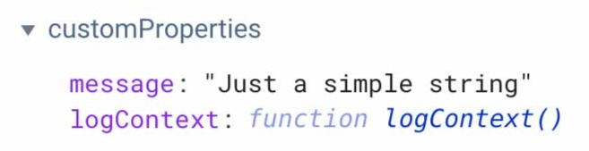
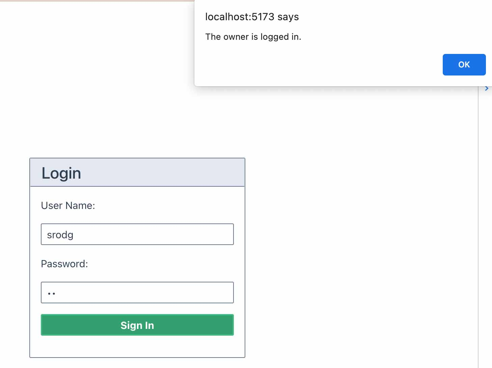

## Complementos de Pinia

>Terminaremos este tutorial echando un vistazo a una herramienta importante que puede ayudarnos a expandir la funcionalidad de Pinia: los
complementos.

Un complemento es una forma de extender una API para que pueda hacer cosas más allá de lo que viene de fábrica. Es imposible anticipar todas las necesidades posibles que tendrá un desarrollador que trabaja con Pinia, pero dado que podemos crear complementos, podemos agregar a Pinia para que pueda satisfacer nuestras necesidades aún mejor.

## Cuándo escribir un complemento

Si tenemos una lógica que queremos reutilizar, como una función de utilidad que ayuda a validar que una fecha tiene el formato correcto, podemos crear composables para hacerlo.

Pero si la funcionalidad que necesitamos depende del propio Pinia, es posible que debamos escribir un complemento de Pinia.

>Podemos crear una función de complemento que le dé más funcionalidad a Pinia:

```js
export function myPiniaPlugin() {
  // do something to extend Pinia in some way
}
```

Y luego le decimos a Pinia que use el complemento pasándolo a nuestra instancia de Pinia en el archivo `main.js` con `pinia.use()`.

```js
pinia.use(myPiniaPlugin)
```

Pinia does something helpful for us when it adds the plugin to our Pinia instance. When we add a plugin with .use(), Pinia also takes the opportunity to add extra information about our Pinia instance and our app that could be helpful to us. This is called the context.

>Pinia hace algo útil para nosotros cuando agrega el complemento a nuestra instancia de Pinia. Cuando agregamos un complemento con `.use()`, Pinia también aprovecha la oportunidad para agregar información adicional sobre nuestra instancia de Pinia y nuestra aplicación que podría sernos útil. Esto se llama el contexto.

Pinia asigna el objeto de `context` a nuestro complemento para que podamos acceder a todas las propiedades que podamos necesitar al crear más funciones en Pinia.

```js
export function myPiniaPlugin(context) {
  context.pinia // the pinia instance created with `createPinia()`
  context.app // the current app created with `createApp()` (Vue 3 only)
  context.store // the store the plugin is augmenting
  context.options // the options object defining the store passed to `defineStore()`
  // ...
}
```

Cuando se trata de crear nuestros propios complementos, el cielo es realmente el límite. Pero por hoy, echemos un vistazo a tres patrones útiles para crear uno:

- Un complemento para agregar una propiedad o método a una tienda
- Un complemento que se ejecuta cuando ocurre una mutación o evento
- Un complemento que agrega una nueva opción a la tienda (como `state`, `actions`, `getters`, `ourPlugin`)

## Agregar una propiedad o método a una tienda

Podemos agregar una propiedad a la tienda escribiendo un complemento simple que devuelva una propiedad de mensaje.

`📄 main.js`
```js
function pluginProperty() {
  return {
    message: "Just a simple string",
  };
}

pinia.use(pluginProperty);
```

>Observe cómo estamos en `main.js` y le indicamos a Pinia que `use()` el complemento que acabamos de crear.

De manera similar, podemos usar un complemento para agregar un método a una tienda.

Tenga en cuenta que tenemos acceso a ese argumento de contexto si lo necesitamos. Entonces, escribamos un complemento simple que devuelva una función que registre un `console.log` con el objeto `context`.

Esta vez, escribiremos el complemento dentro de un nuevo archivo dentro de un directorio de complementos en el directorio de tiendas de nuestro proyecto.

`📄 /stores/plugins/pluginMethod.js`
```js
function pluginMethod(context) {
  return {
    logContext: function () {
      console.log(context);
    },
  };
}
```

Luego necesitaremos importar ese complemento y decirle a Pinia que lo use:

`📄 main.js`
```
// import the plugin from ./stores/plugins

pinia.use(pluginMethod);
```

Ahora que el método de este complemento está disponible para Pinia, usémoslo en la tienda de autenticación, registrando el objeto de `context` cada vez que alguien se autentica en nuestra aplicación.

`📄 src/stores/auth.js`
```js
async login(username, password) {
  this.logContext(); // here's the method from the plugin    
  const body = { username, password };
  myFetch("login", "POST", body).then((res) => {
  this.user = res.response.value.user
  });
},
```

En las **devtools**, podemos ver que la propiedad y el método están disponibles en la tienda en la sección **customProperties**.

Podemos usarlas en nuestras tiendas según sea necesario.



>Complemento para ejecutar cuando ocurre una Mutación o Acción

Ahora echemos un vistazo a cómo podemos escribir un complemento que se base en la API de Pinia.

## $subscribe

>En este primer ejemplo, escribiremos un complemento que utilice el método auxiliar `$subscribe` de Pinia.

El método `$subscribe` es similar al `watch` de Vue. Podemos usarlo para suscribirnos o vigilar mutaciones, de modo que cuando ocurra una mutación en particular, podamos realizar un efecto secundario.

In this example, we are going to subscribe to mutations in the auth store. We want to know if the owner of the website logs in. If she does, we’ll trigger an alert to greet that owner.

En este ejemplo, vamos a suscribirnos a las mutaciones en la tienda de autenticación. Queremos saber si el propietario del sitio web inicia sesión. Si lo hace, activaremos una alerta para saludar a ese propietario.

`📄 greetOwnerPlugin.js`
```js
export function greetOwnerPlugin(context) {
  context && context.store.$subscribe((mutation, state) => {
    if (mutation.storeId === "auth") {
      if (state.user && state.user.username === "srodg") {
        alert("The owner is logged in.");
      }
    }
  });
}
```

Usamos o extendemos Pinia con el complemento en el archivo `main.js`:

`📄 main.js`
```js
pinia.use(greetOwnerPlugin);
```

A plugin will run anytime a store is created, so this will run whenever the auth store is created, but it will also run whenever the three other stores in our project are created (geolocation store, favorites store, and restaurants store). However, we only care about the mutations in the auth store.

The $subscribe method gives us access to the mutation by its storeId, so we can tell the plugin to just send an alert when the relevant action in the auth store occurs.

Now when I log in, the app greets me with the alert (since I am the owner!).



While this alert feature is a bit contrived, we could extend this plugin to run a specific Action only when an admin of the site logs in, like to fetch some protected data.

## Using $onAction in Plugins

We’ve already seen the $onAction helper method in this course. When it comes to Pinia plugins, we can use $onAction to achieve special behavior with Actions, such as:

- Run code before an Action runs
- Run code after an Action has run
- Run code when an Action fails
- Cancel an Action

Let’s write a plugin that uses $onAction to do something depending on if a user logs in, logs out, or registers.

In this example, the $onAction method watches all Pinia actions, and if one occurs in the auth store, it checks which Action it is. Based on that action, it will send an alert.

`📄 greetUserPlugin.js`
```js
export function greetUserPlugin({ store }) {
  store.$onAction((action) => {
    if (store.$id === "auth") {
      switch (action.name) {
        case "login":
          alert("Welcome back to Pinia Restaurants!");
          break;
        case "logout":
          alert("Hope you enjoyed Pinia Restaurants!");
          break;
        case "register":
          alert("Welcome to Pinia Restaurants!");
          break;
      }
    }
  });
}
```

Now let’s test it out in the browser.

## Adding the after hook

To take this plugin a bit further, we could even use the after hook to make sure the alert appears only once the Action is completed. In the example below, we deconstruct the name and method off of the context object.

`📄 greetUserPlugin.js`
```js
export function greetUserPlugin({ store }) {
  store.$onAction(({ name, after }) => { // deconstruct off context obj
    if (store.$id === "auth") {
      switch (name) {
        case "login":
          after(() => {
            alert("Welcome back to Pinia Restaurants!");
          });
          break;
        case "logout":
          after(() => {
            alert("Hope you enjoyed Pinia Restaurants!");
          });
          break;
        case "register":
          after(() => {
            alert("Welcome to Pinia Restaurants!");
          });
          break;
      }
    }
  });
}
```

## An Elegant Use Case

Another cool use case for $onAction is this elegant solution presented by Eduardo San Martin Morote, creator of Pinia.

`📄 main.js`
```js
export function ({ store }) => {
  store.$onAction(({ name, store, args, after, onError }, state) => {
    onError(error => {
      sendErrors(name, args, error)
    })
  })
})
```

This plugin can be used to take errors that happen within Actions, and send them to an external service that you use, such as Sentry. This is super helpful to detect bugs during production.

## Add an Option to the Store

The last pattern we’ll look at is an interesting one because it allows us to send data from a store directly to a plugin.

We can add an option to a store. When I say “option” in relation to Vue, I mean properties available on the Vue instance, such as data , computed, and methods in the Options API.

Or in a Pinia options store, the options refer to state, getters, or actions.

If we create our own option in a Pinia store, we can add properties to that option.

`📄 src/stores/auth.js`
```js
export const useAuthStore = defineStore("auth", {
  state: () => ({
    // ... 
  }),
  getters: {
    // ...
  },
  actions: {
    // ...
  },
  greeting: {
    enabled: true,
  },
});
```

In the example, the option we have created is called greeting. We’re adding a property called enabled so that we can send either true or false to the plugin. Based on that boolean, we will turn the plugin on or off.

Here is how that plugin could be constructed:

`📄 stores/plugins/greetUserPlugin.js`
```js
export function greetUserPlugin({ store, options }) {
  if (options.greeting && options.greeting.enabled) {
    store.$onAction((action) => {
      switch (action.name) {
        case "login":
          alert("Welcome back to Pinia Restaurants!");
          break;
        case "logout":
          alert("Hope you enjoyed Pinia Restaurants!");
          break;
        case "register":
          alert("Welcome to Pinia Restaurants!");
          break;
      }
    });
  }
}
```

The if statement if (options.greeting && options.greeting.enabled) relies on the enabled property being set to true.

If it’s set to false, the plugin won’t run the logic, so the $onAction method will not watch every Pinia action.

We could set properties in the option for any data we want our plugin to be able to use.

Adding an Option to Setup Stores

By the way, we can also create options for Pinia plugins in a setup store. We do that by adding the option as a third argument when writing the setup function for the store:

`📄 src/stores/auth.js`
```js
defineStore('auth',() => {...},
  {
    greeting: {
      enable: true,
    },
  }
)
```

A handy open source plugin

As you can imagine, this has a lot of potential to be useful when developing open source plugins for other Vue developers using Pinia.

There are really so many possibilities for what we can do by creating our own plugins. The Vue open source community is starting to create useful plugins that are being shared, so keep an eye out for exciting enhancements developers will build.

For example, let’s look at the simple but effective public plugin called pinia-plugin-persistedstate.

As it sounds, it’s a Pinia plugin that enables us to persist our state despite a browser refresh.

To make use of it, we’d install it into our project.

npm : npm i pinia-plugin-persistedstate
yarn : yarn add pinia-plugin-persistedstate

Then import it into main.js and tell Pinia to use it.

`📄 main.js`
```js
import { createPinia } from 'pinia'
import piniaPluginPersistedstate from 'pinia-plugin-persistedstate'

const pinia = createPinia()
pinia.use(piniaPluginPersistedstate)
```

We then need to make sure to add the persist:true option to the store we want to be persisted:

```js
import { defineStore } from 'auth'

export const useAuthStore = defineStore('auth', {
  state: () => {
    return {
      someState: 'hello pinia',
    }
  },
  persist: true,
})
```

As you can see in the browser, now our state is being persisted.

## Course Conclusion

I really hope you enjoyed this course on Proven Pinia Patterns!

Pinia is such a flexible library that can adapt to your needs. Knowing a range of different patterns we can use will help us to get the most out of Pinia for all types of Vue projects.

>Thanks for watching!
